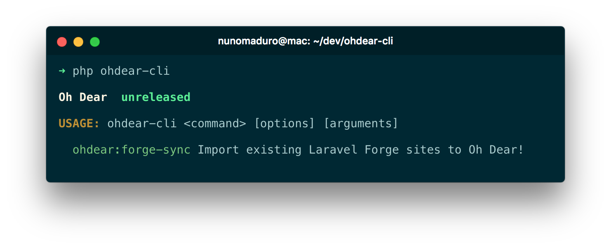

<p align="center">
    
</p>

<p align="center">
  <a href="https://styleci.io/repos/121807251"></a>
  <a href="https://packagist.org/packages/nunomaduro/ohdear-cli"></a>
  <a href="https://packagist.org/packages/nunomaduro/ohdear-cli"></a>
</p>

## About Oh Dear CLI

Oh Dear CLI was created by [Nuno Maduro](https://github.com/nunomaduro), and is maintained by [Owen Voke](https://github.com/owenvoke) , and is an Oh Dear CLI tool written in PHP with Laravel Zero.

## Install

> **Requires [PHP 7.4+](https://php.net/releases)**

Via Composer

```bash
composer require nunomaduro/ohdear-cli
```

Then set your API key in the `OHDEAR_API_TOKEN` environment variable, you can generate one from [the API access page](https://ohdear.app/user-settings/api).

## Usage

```bash
ohdear-cli list
```

**Available commands**

- `ohdear-cli me`  
   Display details about the currently authenticated user
- `ohdear-cli sites:add [url]`  
   Add a new site to Oh Dear
- `ohdear-cli sites:list`  
   Display a list of sites and their current status
- `ohdear-cli sites:show [id]`  
   Display details about a specific site
- `ohdear-cli status-pages:list`  
   Display a list of status pages and their current status
- `ohdear-cli status-pages:show [id]`  
   Display details about a specific status page
- `ohdear-cli performance:show [id]`  
   Display performance details for a specific site
- `ohdear-cli maintenance-period:add [site-id] [start-date] [end-date]`  
   Add a new maintenance period for a site
- `ohdear-cli maintenance-period:delete [id]`  
   Delete a maintenance period
- `ohdear-cli maintenance-period:show [id]`  
   Display maintenance periods for a specific site
- `ohdear-cli maintenance-period:start [site-id] [seconds]`  
   Start a new maintenance period for a site
- `ohdear-cli maintenance-period:stop [site-id]`  
   Stop the currently active maintenance period for a site
- `ohdear-cli mixed-content:show [site-id]`  
   Display mixed content for a specific site
- `ohdear-cli broken-link:show [site-id]`  
   Display broken links for a specific site
- `ohdear-cli certificate-health:show [site-id] [--checks] [--issuers]`  
   Display certificate health for a specific site (use `--checks` or `--issuers` for additional information)

## Contributing

Thank you for considering contributing to Oh Dear CLI. All the contribution guidelines are mentioned [here](CONTRIBUTING.md).

You can have a look at the [CHANGELOG](CHANGELOG.md) for constant updates & detailed information about the changes. You can also follow the Twitter account for latest announcements or just come say hi!: [@enunomaduro](https://twitter.com/enunomaduro)

## Support the development
**Do you like this project? Support it by donating**

- PayPal: [Donate](https://www.paypal.com/cgi-bin/webscr?cmd=_s-xclick&hosted_button_id=66BYDWAT92N6L)
- Patreon: [Donate](https://www.patreon.com/nunomaduro)

## License

Oh Dear CLI is an open-sourced software licensed under the [MIT license](LICENSE.md).
