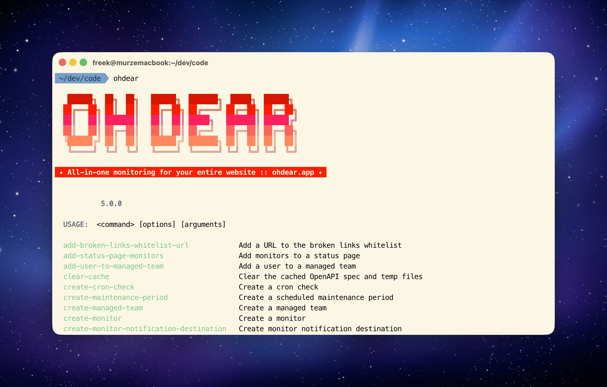

<p align="center">
    
</p>

<p align="center">
  <a href="https://github.com/ohdearapp/ohdear-cli/actions/workflows/static.yml"></a>
    <a href="https://packagist.org/packages/ohdearapp/ohdear-cli"></a>
  <a href="https://packagist.org/packages/ohdearapp/ohdear-cli"></a>
</p>

## About Oh Dear CLI

Oh Dear CLI is a command line tool to manage [Oh Dear](https://ohdear.app) website monitoring. Built with Laravel Zero, it auto-generates commands from the Oh Dear OpenAPI spec so every API endpoint is available as a CLI command.

## Install

> **Requires [PHP 8.4+](https://php.net/releases)**

Via Composer

```shell
composer global require ohdearapp/ohdear-cli
```

Ensure Composer's global bin directory is in your `PATH`:

```shell
composer global config bin-dir --absolute
```

## Authentication

First, log in with your Oh Dear API token. You can generate one at [ohdear.app/user-settings/api](https://ohdear.app/user-settings/api).

```shell
ohdear login
```

You'll be prompted for your API token. The token is stored in `~/.ohdear/config.json`.

To log out:

```shell
ohdear logout
```

## Usage

List all available commands:

```shell
ohdear list
```

### Monitors

```shell
# List all monitors
ohdear list-monitors

# Get a specific monitor
ohdear get-monitor --monitor-id=123

# Add a new monitor
ohdear create-monitor --field url="https://example.com" --field team_id=1

# Delete a monitor
ohdear delete-monitor --monitor-id=123
```

### Uptime and downtime

```shell
ohdear get-uptime --monitor-id=123
ohdear get-downtime --monitor-id=123
```

### Broken links and mixed content

```shell
ohdear list-broken-links --monitor-id=123
ohdear list-mixed-content --monitor-id=123
```

### Certificate health

```shell
ohdear get-certificate-health --monitor-id=123
```

### Maintenance periods

```shell
ohdear start-maintenance --monitor-id=123
ohdear stop-maintenance --monitor-id=123
ohdear list-maintenance-periods --monitor-id=123
```

### Status pages

```shell
ohdear list-status-pages
ohdear get-status-page --status-page-id=123
ohdear create-status-page-update --status-page-id=123 --field title="Investigating" --field text="Looking into it."
```

### Cron checks

```shell
ohdear list-cron-checks --monitor-id=123
ohdear create-cron-check --monitor-id=123 --field name="Daily Backup" --field frequency_in_minutes=1440
```

### Lighthouse reports

```shell
ohdear get-latest-lighthouse-report --monitor-id=123
ohdear list-lighthouse-reports --monitor-id=123
```

### Other commands

```shell
ohdear get-me                    # Display authenticated user info
ohdear get-dns-history           # DNS history for a monitor
ohdear list-application-health-checks  # Application health checks
ohdear list-tags                 # List all tags
ohdear clear-cache               # Clear cached OpenAPI spec
```

By default, commands output human-readable text. Add `--json` for JSON output. Run `ohdear <command> --help` for full parameter details.

## AI Skill

Install the Oh Dear skill for AI coding assistants:

```shell
ohdear install-skill
```

## Contributing

Thank you for considering contributing to Oh Dear CLI. All contributions are welcome via pull requests.

You can have a look at the [CHANGELOG](CHANGELOG.md) for constant updates and detailed information about the changes.

## License

Oh Dear CLI is an open-sourced software licensed under the [MIT license](LICENSE.md).
